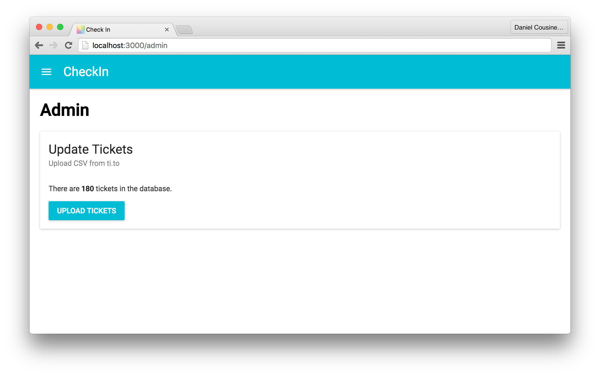
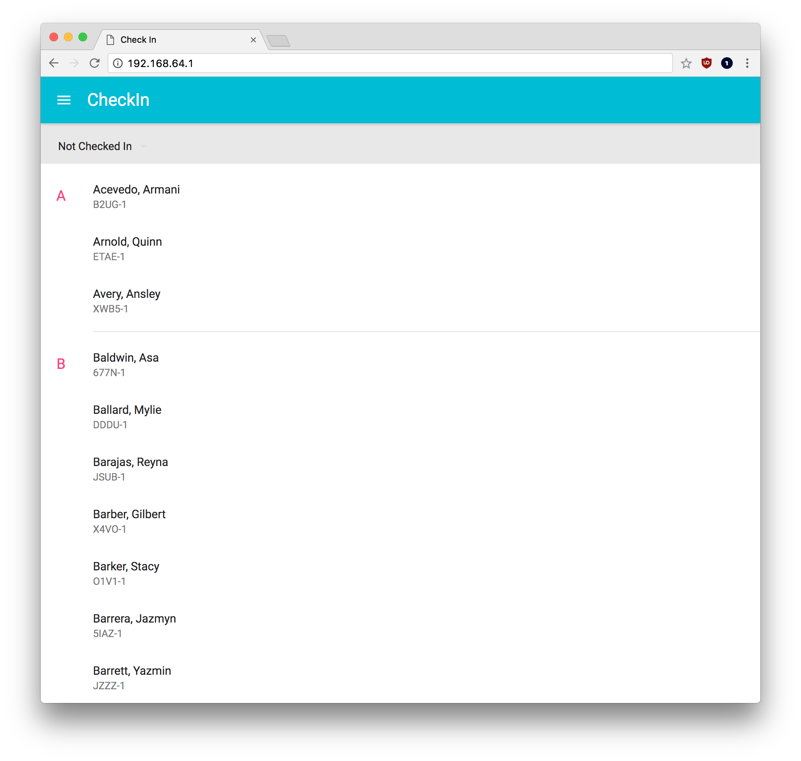
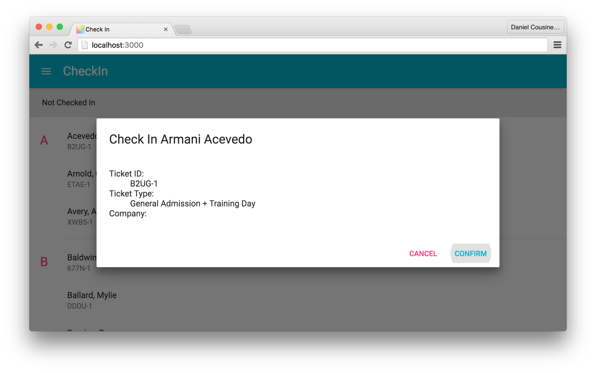
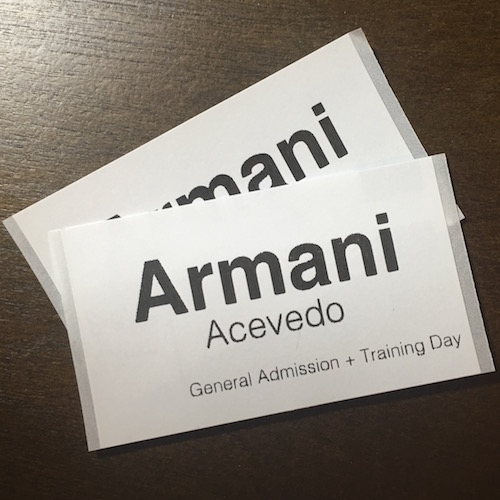

# Conference Check In

## Quick Start

1. Clone this repo and run `npm install`
3. Run `npm start` to initialize the server
4. Navigate to [http://localhost:3000/](http://localhost:3000/) in your browser

## Production Mode

1. Clone this repo and run `npm install`
2. Run `npm run prod`
3. Open your browser to the IP address it declares it is listening at
4. Other devices on the same network should be able to access via this IP as well

## Screenshots

Above badges were printed with a [Brother QL-700](http://www.brother-usa.com/LabelPrinter/ModelDetail/23/ql700/Overview)

## License

This application is licensed under the [GPL v2 License](http://www.gnu.org/licenses/old-licenses/gpl-2.0.en.html)
